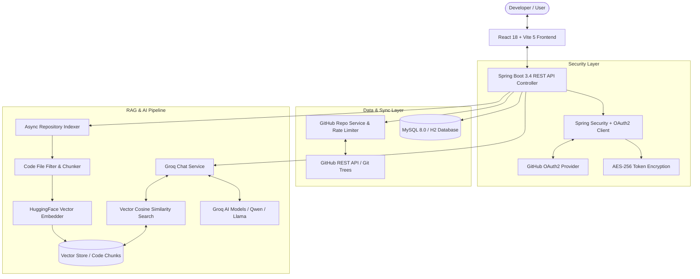

# 🚀 DevPilot — AI-Powered GitHub Repository Intelligence & Code Analysis Platform

[](https://spring.io/projects/spring-boot)
[](https://www.oracle.com/java/)
[](https://react.dev/)
[](https://vitejs.dev/)
[](https://tailwindcss.com/)
[](LICENSE)

**DevPilot** is a minimalist, modern, full-stack GitHub Repository Analysis and Code Intelligence Platform. Built using **Spring Boot 3.4** (Java 21) and **React 18 + Vite 5**, DevPilot provides real-time multi-language repository indexing, vector-based Retrieval-Augmented Generation (RAG), line-accurate source code citation, and interactive AI chat powered by high-performance LLM engines.

---

## 📌 Table of Contents
- [Overview](#-overview)
- [Key Features](#-key-features)
- [System Architecture](#-system-architecture)
- [Tech Stack](#-tech-stack)
- [Detailed Technical Implementations](#-detailed-technical-implementations)
  - [1. Authentication & Security Pipeline](#1-authentication--security-pipeline)
  - [2. Multi-Language Repository Ingestion & Filtering](#2-multi-language-repository-ingestion--filtering)
  - [3. Code Chunking & RAG Vector Indexing](#3-code-chunking--rag-vector-indexing)
  - [4. Context-Aware RAG Engine & Model Fallback Chain](#4-context-aware-rag-engine--model-fallback-chain)
  - [5. Database Schema & Data Models](#5-database-schema--data-models)
- [API Reference](#-api-reference)
- [Getting Started & Local Setup](#-getting-started--local-setup)
  - [Prerequisites](#prerequisites)
  - [Configuration (.env)](#environment-configuration)
  - [Running Backend](#running-the-backend)
  - [Running Frontend](#running-the-frontend)
  - [Running with Docker Compose](#running-with-docker-compose)
- [Future Scope & Product Roadmap](#-future-scope--product-roadmap)
- [License](#-license)

---

## 🔮 Overview

Navigating and understanding large, complex codebases can be time-consuming for developers. DevPilot acts as an intelligent co-pilot for your software repositories by automatically syncing your GitHub projects, parsing source code structures into vector representations, and providing an interactive chat interface that answers architectural, functional, and implementation questions with exact line-number citations.

Whether you need to onboard onto a new codebase, audit code structure, or debug issues, DevPilot bridges the gap between raw source code and actionable developer insights.

---

## ✨ Key Features

- 🔑 **GitHub OAuth2 & Demo Mode**: Seamless GitHub sign-in with OAuth2 flow, plus an instant zero-config Demo Mode for trial and offline exploring.
- 🔄 **Real-Time Repository Synchronization**: Automatic repository discovery across public and private GitHub repos with language detection (Java, TypeScript, JavaScript, Python, Go, Rust, C++).
- 🧠 **Vector RAG Indexing Pipeline**: Asynchronous background repository indexing that extracts source files, breaks code into overlapping semantic chunks, generates vector embeddings, and persists them into the vector database.
- 💬 **Interactive AI Chat with Source Citations**: Repository-scoped chat interface offering markdown rendering, code highlight, and precise file path + line number citations (`src/main/.../Service.java:L12-L45`).
- 🛡️ **AES-256 Token Encryption**: End-to-end encryption of GitHub OAuth access tokens stored in the persistence layer.
- ⚡ **Multi-Model Fallback Engine**: Integration with Groq high-speed LLM APIs (`qwen/qwen3.8-27b`, `llama-3.1-8b-instant`) with automatic fallback handling to ensure 99.9% chat uptime.
- 🎨 **Sleek White Theme UI**: Modern, glassmorphic dark-mode / minimalist interface crafted with Tailwind CSS v4 and Lucide React icons.

---

## 🏗️ System Architecture



---

## 💻 Tech Stack

### Frontend (`/client`)
- **Framework**: [React 18](https://react.dev/) + [Vite 5](https://vitejs.dev/)
- **Styling**: [Tailwind CSS v4](https://tailwindcss.com/)
- **Icons**: [Lucide React](https://lucide.dev/)
- **Markdown & Code Display**: `react-markdown`
- **State & Context Management**: React Context (`AuthContext`, `ToastContext`), Custom Hooks (`useRepos`)

### Backend (`/backend`)
- **Language & JDK**: Java 21 (JDK 21)
- **Framework**: [Spring Boot 3.4.3](https://spring.io/projects/spring-boot)
- **Security**: Spring Security 6 + Spring OAuth2 Client
- **Data Persistence**: Spring Data JPA + Hibernate
- **Database & Migrations**: 
  - H2 In-Memory DB (Default zero-config for local development)
  - MySQL 8.0 (Production / Containerized)
  - Flyway Database Migrations
- **AI & RAG Engines**:
  - Vector Embeddings: HuggingFace (`sentence-transformers/all-MiniLM-L6-v2`)
  - LLM Inference: Groq OpenAI-compatible REST API (`qwen/qwen3.8-27b`, `llama-3.1-8b-instant`)

### Infrastructure & DevOps
- **Containerization**: Docker & Docker Compose (`mysql:8.0`)
- **Build Tools**: Maven 3.9+ (`mvnw`), Node.js 18+ / `npm`

---

## 🔬 Detailed Technical Implementations

### 1. Authentication & Security Pipeline
- **OAuth2 Flow**: Handles user redirection to GitHub OAuth (`/oauth2/authorization/github`), requests `user, repo` scope, and processes authentication callbacks via `OAuth2AuthenticationSuccessHandler`.
- **Token Security**: OAuth access tokens are encrypted before database insertion using AES-256 GCM algorithm with dynamic dynamic salt (`app.crypto.password`, `app.crypto.salt`).
- **Demo Mode**: Allows zero-auth exploration by generating transient demo security principals.

### 2. Multi-Language Repository Ingestion & Filtering
- **GitHub Tree Traverser**: Fetches tree data directly from GitHub Git Trees API recursively.
- **Smart Filtering (`CodeFileFilter`)**:
  - Filters out binary, image, lock, and compiled files (`.png`, `.exe`, `.jar`, `.lock`, `node_modules/`, `.git/`, `dist/`).
  - Limits max indexed file size (`100 KB` default) and total files per repo (`60 files`) to prevent rate limits and out-of-memory overhead.
  - Priority Queue indexing: Ranks core source files (`.java`, `.ts`, `.py`, `.go`, `.rs`, `.cpp`) ahead of configuration files (`.json`, `.yml`, `.md`).

### 3. Code Chunking & RAG Vector Indexing
- **Overlapping Sliding Window Chunker (`CodeChunker`)**:
  - Splits source files into chunks of **800 characters** with an overlap of **150 characters**.
  - Tracks starting line (`startLine`) and ending line (`endLine`) for accurate code retrieval and display.
- **Vector Embedding Generation (`EmbeddingService`)**:
  - Generates 384-dimensional dense floating-point vector embeddings per chunk using sentence transformers.
  - Serializes vector arrays to JSON format stored alongside metadata (`file_path`, `chunk_index`, `start_line`, `end_line`) in `code_chunks` table.

### 4. Context-Aware RAG Engine & Model Fallback Chain
- **Cosine Similarity Search (`VectorStoreService`)**:
  - Computes dot product and vector norm comparisons across repository chunk vectors against user prompt query vectors.
  - Filters noise using thresholding (`similarity_score > 0.05`) and selects top $K=4$ relevant snippets.
- **Dynamic Prompt Engineering (`ChatPromptBuilder`)**:
  - Constructs system prompts embedding formatted source context chunks, instructing the model to cite files and line ranges.
- **Multi-Model Resiliency**:
  - Automatically attempts primary model (`qwen/qwen3.8-27b`), seamlessly switching to secondary models (`llama-3.1-8b-instant`, `groq/compound`) upon rate limits or availability errors.

### 5. Database Schema & Data Models

```sql
users (id UUID PRIMARY KEY, github_id BIGINT, username VARCHAR, email VARCHAR, avatar_url VARCHAR, encrypted_access_token TEXT, created_at TIMESTAMP);
repositories (id UUID PRIMARY KEY, user_id UUID, github_repo_id BIGINT, owner VARCHAR, name VARCHAR, full_name VARCHAR, default_branch VARCHAR, index_status VARCHAR, files_processed INT, files_total INT, chunk_count INT, indexed_at TIMESTAMP);
code_chunks (id UUID PRIMARY KEY, repo_id UUID, file_path VARCHAR, chunk_index INT, start_line INT, end_line INT, content TEXT, embedding_json LONGTEXT);
chat_sessions (id UUID PRIMARY KEY, user_id UUID, repo_id UUID, title VARCHAR, created_at TIMESTAMP);
chat_messages (id UUID PRIMARY KEY, session_id UUID, role VARCHAR, content VARCHAR, citations_json TEXT, created_at TIMESTAMP);
```

---

## 📡 API Reference

### Authentication
- `GET /api/auth/me` — Get current logged-in user profile.
- `GET /api/auth/login-url` — Get GitHub OAuth redirect URL.

### Repositories
- `GET /api/repositories` — List user's synchronized GitHub repositories.
- `POST /api/repositories/sync` — Trigger immediate GitHub account repository sync.
- `GET /api/repositories/{id}` — Get single repository metadata and indexing status.
- `POST /api/repositories/{id}/index` — Trigger async vector indexing pipeline for a repository.
- `POST /api/repositories/{id}/chat` — Directly execute RAG query chat against repository context.

### Chat & Sessions
- `POST /api/chat/sessions` — Create a new chat session bound to a repository.
- `GET /api/chat/sessions?repositoryId={id}` — List chat sessions for user or repository.
- `GET /api/chat/sessions/{sessionId}/messages` — Fetch message history for a chat session.
- `POST /api/chat/messages` — Send user message and get AI response with citations.

---

## 🛠️ Getting Started & Local Setup

### Prerequisites
- **Java 21+** (JDK 21)
- **Node.js 18+** & `npm`
- **Docker & Docker Compose** *(Optional, for MySQL)*

### Environment Configuration
Create a `.env` file in the root directory (or pass environment variables):

```env
# Database Credentials
DB_URL=jdbc:h2:mem:devpilot;MODE=MySQL;DB_CLOSE_DELAY=-1
DB_USER=root
DB_PASSWORD=rootpassword

# AI Models (Groq API Key)
GROQ_API_KEY=your_groq_api_key_here
GROQ_MODEL=qwen/qwen3.8-27b

# GitHub OAuth App Credentials
GITHUB_CLIENT_ID=your_github_client_id
GITHUB_CLIENT_SECRET=your_github_client_secret

# Security Crypto
APP_CRYPTO_PASSWORD=devpilot-secure-crypto-key
APP_CRYPTO_SALT=12345678
```

### Running the Backend
```bash
cd backend
./mvnw spring-boot:run
```
The REST API server will start on `http://localhost:8080`.

### Running the Frontend
In a new terminal window:
```bash
cd client
npm install
npm run dev
```
The Vite development server will start on `http://localhost:3000`.

### Running with Docker Compose
To launch MySQL 8.0 database container locally:
```bash
docker-compose up -d
```

---

## 🔮 Future Scope & Product Roadmap

- [ ] **Tree-Sitter AST Syntax Chunking**: Replace line sliding-window chunking with AST syntax tree parsing for language-aware function, class, and interface chunking.
- [ ] **Real-Time WebSockets & Server-Sent Events (SSE)**: Enable token-by-token streaming AI responses and real-time indexing progress updates.
- [ ] **Automated SAST Security Auditing**: Integrated static application security testing scanning for OWASP Top 10 vulnerabilities, hardcoded secrets, and SQL injections.
- [ ] **Multi-Vector DB Plugin Support**: Support production vector databases including `pgvector`, `Qdrant`, `Milvus`, and `ChromaDB`.
- [ ] **GitHub Pull Request AI Bot**: Automated GitHub Action webhook integration to auto-review incoming PRs and provide architectural feedback.

---

## 📄 License

Distributed under the **MIT License**. See `LICENSE` for more information.

&copy; 2026 DevPilot. Built with ❤️ for developers worldwide.
